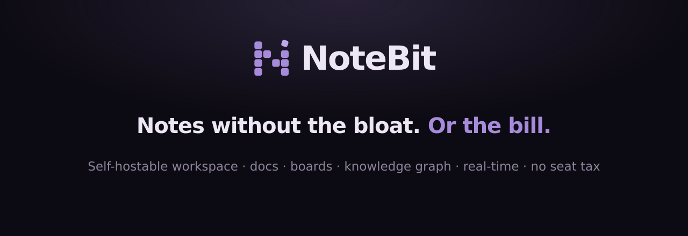

<div align="center">



[](LICENSE)
[](https://github.com/GroyalCodes/notebit/releases)
[](#self-host)
[](https://github.com/GroyalCodes/notebit/stargazers)

**A clean, self-hostable workspace for docs, boards, and team knowledge.**

Real-time collaboration, Kanban boards, a knowledge graph, per-page permissions, and web publishing. Your data, your server, no seat limits.

[Website](https://notebit.org) · [Self-host](#self-host) · [Cloud](https://notebit.org#pricing) · [Releases](https://github.com/GroyalCodes/notebit/releases)

</div>

---

## Why NoteBit

Notes apps got bloated and pricey. NoteBit is neither.

- **Truly self-hostable**: one container, one SQLite file. No external services required.
- **No seat tax**: invite your whole team; the self-hosted version is never seat-capped.
- **Everything is a connected page**: docs, board columns, and cards are all pages, visualised in an interactive **knowledge graph**.
- **Real-time collaboration**: Google-Docs-style multiplayer cursors out of the box.
- **Kanban that fits**: columns and cards are first-class pages with per-column permissions and an approval workflow.
- **Multiple workspaces**: one per team or project, each with its own members and settings.
- **Publish to the web**: share any page or board publicly, read-only.
- **Own your data**: it all lives in one SQLite database you control.

## Self-host

One line. No Docker needed:

```bash
curl -fsSL https://notebit.org/install.sh | bash
```

On Windows (PowerShell):

```powershell
irm https://notebit.org/install.ps1 | iex
```

The installer uses your Node if you have version 20 or newer, or fetches a private runtime that lives inside the notebit folder and touches nothing else. It downloads the prebuilt app, starts it in the background, and opens http://localhost:8200. Your notes live in `notebit/data` as a single SQLite database; back up that folder and you have backed up everything. Re-run the installer any time to update.

`start.sh` / `stop.sh` (or `Start NoteBit.bat` / `Stop NoteBit.bat` on Windows) control it afterwards.

### Prefer Docker?

Docker is fully supported, just optional:

```bash
NOTEBIT_DOCKER=1 bash -c "$(curl -fsSL https://notebit.org/install.sh)"
# or by hand:
git clone https://github.com/GroyalCodes/notebit.git
cd notebit && docker compose up -d
```

In Docker, data lives in the `notebit-data` volume instead.

### Configuration

All optional except where noted. Set via environment in `docker-compose.yml` or a `.env` file (see `.env.example`):

| Variable | Default | What it does |
|---|---|---|
| `PORT` | `8200` | Port the server listens on |
| `APP_URL` | `http://localhost:8200` | Public URL, used in invite emails |
| `WIKI_DB` | `/data/notebit.db` | Database location |
| `RESEND_API_KEY` | unset | Enables email invites ([resend.com](https://resend.com)) |
| `MAIL_FROM` | unset | From address for invite emails |
| `ALLOW_SIGNUP` | `true` | Set `false` for invite-only |

### Updating

**Native installs**: re-run the install one-liner. It swaps the app and keeps your data.

**Docker installs**: run `./update.sh` (that's just `git pull && docker compose up -d --build`).

Either way your data is kept, and schema migrations run automatically on startup. NoteBit shows an **"update available"** notice in **Settings → Account → About** when a newer release is out; check the running version any time at `GET /api/version`.

### Uninstalling

From the folder you installed in:

```bash
./uninstall.sh            # macOS / Linux
irm https://notebit.org/uninstall.ps1 | iex   # Windows
```

It removes the container and image, and asks before touching your notes. If you keep the `notebit-data` volume (the default), reinstalling later brings every page back.

### Serve it on your own domain

Put any reverse proxy in front of port 8200 and set `APP_URL` so invite links use your domain. With [Caddy](https://caddyserver.com) it is three lines and HTTPS is automatic:

```
notes.yourdomain.com {
    reverse_proxy localhost:8200
}
```

Nginx works too; make sure WebSocket upgrades are passed through (real-time editing uses them):

```nginx
location / {
    proxy_pass http://127.0.0.1:8200;
    proxy_http_version 1.1;
    proxy_set_header Upgrade $http_upgrade;
    proxy_set_header Connection "upgrade";
}
```

Then set `APP_URL: "https://notes.yourdomain.com"` in `docker-compose.yml` and restart. A [Cloudflare Tunnel](https://developers.cloudflare.com/cloudflare-one/connections/connect-networks/) pointed at `localhost:8200` also works well if you cannot open ports.

## Don't want to host it?

[**NoteBit Cloud**](https://notebit.org#pricing) is the managed option: we host, back up, and update it for one flat price per workspace, with unlimited members. No per-seat bill.

## Run without Docker (development)

```bash
# server
cd server && npm install && npm start      # http://127.0.0.1:8200
# web (in another terminal)
cd web && npm install && npm run dev        # http://localhost:5173
```

## Stack

Node 22 · Fastify 5 · better-sqlite3 · React 18 · Vite 6 · BlockNote · Yjs (real-time). No external database, queue, or cache.

## License

[AGPL-3.0-or-later](LICENSE). Self-host and modify NoteBit freely; if you offer it as a network service, make your source available under the same license. A managed, fully-hosted option is available at [notebit.org](https://notebit.org).
